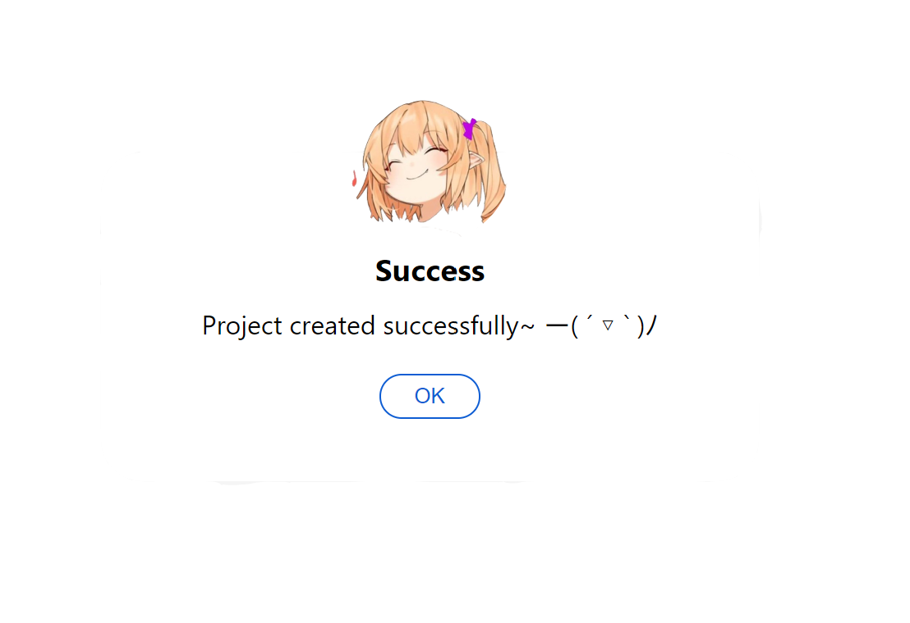
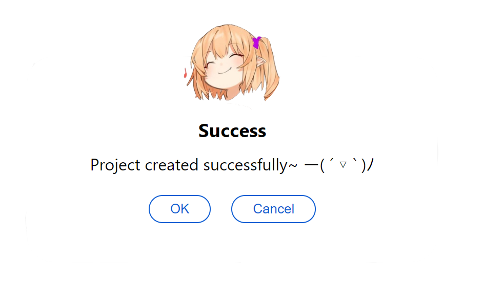

# react-feedback-modal

> A beautiful and simple feedback dialog react components.

[](https://www.npmjs.com/package/react-feedback-modal) [](https://standardjs.com)



## Install

```bash
npm install react-feedback-modal
```

If you are using yarn

```bash
yarn add react-feedback-modal
```

## Import

```js
import { Feedback } from 'react-feedback-modal'
```

## Parameters

| Parameters      | Default                         | Description                                                         | Type          |
| --------------- | ------------------------------- | ------------------------------------------------------------------- | ------------- |
| show            | true                            | Display the modal. e.g. true will display.                          | boolean       |
| imgUrl          | '/assets/emoji_happy.png'       | The icon of the modal.                                              | string        |
| status          | 'Success'                       | Information about the status of the modal                           | string        |
| msg             | 'Project created successfully~' | Details about the modal message                                     | string        |
| okText          | 'OK'                            | Primary ok button display text                                      | string        |
| cancelText      | 'Cancel'                        | Secondary cancel button display text                                | string        |
| confirm         | false                           | Enable will display the cancel button                               | boolean       |
| save            | handleReload                    | Function when click the ok button, default will reload the page     | function:void |
| cancel          | handleReload                    | Function when click the cancel button, default will reload the page | function:void |
| width           | '400px'                         | The width of the modal                                              | string        |
| height          | '200px'                         | The hight of the modal                                              | string        |
| backgroundColor | '#fff'                          | The background color of the modal                                   | string        |
| borderRadisu    | '25px'                          | The border radius of the modal                                      | string        |

## Usage

### Default Feedback Modal

By default, the page will reload once the button being fired.

```jsx
import React from 'react'
import { Feedback } from 'react-feedback-modal'

export default function App() {
  return <Feedback show={true} />
}
```

### Binding the display with your hooks

We could create our own method that we want after click the button. The code below will disable the modal if click cancel, and reload if click ok.



```js
import React, { useState } from 'react'
import { Feedback } from 'react-feedback-modal'

export default function App() {
  const [show, setShow] = useState < boolean > false

  const offFeedback = (): void => {
    setShow(false)
  }

  const showFeedback = (): void => {
    setShow(true)
  }

  return (
    <div>
      <button onClick={showFeedback}>Submit Form</button>

      <Feedback show={show} confirm={true} cancel={offFeedback} />
    </div>
  )
}
```

## Uninstall

In your project directory, run

```bash
npm uninstall react-feedback-modal
```

If you are using yarn

```bash
yarn remove react-feedback-modal
```

## ChangeLog

- 2020/06/23 version 1.0.1 publish

## License

MIT © [yang052513](https://github.com/yang052513)
